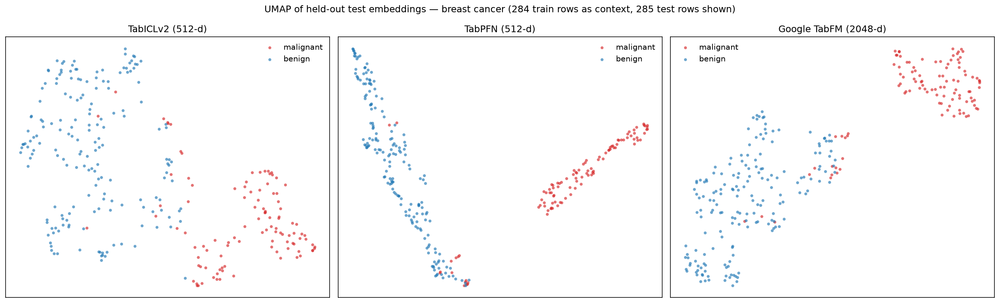

# tfm-transformers

**Sentence-transformers-style embeddings for tabular foundation models.**

Tabular foundation models like [TabICL](https://github.com/soda-inria/tabicl) and
[TabPFN](https://github.com/PriorLabs/TabPFN) compute rich per-row representations
internally as part of in-context learning. `tfm-transformers` exposes them behind
the familiar encode/similarity API from
[sentence-transformers](https://www.sbert.net/), for similarity search, retrieval,
clustering, visualization, and feature extraction on tabular data.

> ⚠️ Experimental, early-stage project. APIs may change.



*UMAP of **held-out test rows** on breast cancer, embedded by all three backends
through the same two lines of code: `model.fit(X_train, y_train)` then
`model.encode(X_test)`. The test rows are never part of the context, so the
separation is genuinely inferred. Reproduce with
[`examples/visualize_test_embeddings.py`](examples/visualize_test_embeddings.py).*

## Installation

```bash
pip install tfm-transformers[tabicl]   # TabICL backend
pip install tfm-transformers[tabpfn]   # TabPFN backend
pip install tfm-transformers[tabfm]    # Google TabFM backend (Python >= 3.11)
pip install tfm-transformers[all]      # everything
```

## Usage

```python
from tfm_transformers import TabularTransformer

# 1. Load a tabular foundation model
model = TabularTransformer("tabicl")

# 2. Set the context table — all embeddings are conditioned on it
model.fit(X_corpus, y_corpus)  # y is optional

# 3. Calculate embeddings by calling model.encode()
embeddings = model.encode(X_corpus)
print(embeddings.shape)
# (469, 512)

# 4. Calculate the embedding similarities
query_embeddings = model.encode(X_query)
similarities = model.similarity(query_embeddings, embeddings)

# 5. Or retrieve the most similar corpus rows directly
indices, scores = model.search(X_query, top_k=5)
```

## How this differs from sentence embeddings

Sentence embeddings are context-free: a sentence always maps to the same vector.
Tabular foundation model embeddings are **context-dependent** — a row's vector is
conditioned on the entire context table (column distributions and, for
target-aware models, the labels). This has three practical consequences:

1. **`fit` comes first.** The context table is part of the model state. Every
   `encode` call embeds rows against it as unseen test rows.
2. **Embeddings are only comparable within one fitted model.** There is no shared
   embedding space across tables, contexts, or backends.
3. **Labels shape the space.** With `y` provided, similarity is task-aware:
   rows that the model treats similarly *for predicting `y`* end up close. With
   `y=None`, a pseudo-target is synthesized for approximately unsupervised
   embeddings (experimental).

Rows passed to `encode` are always embedded as test rows, so their own labels are
never visible to the model — embedding your corpus does not leak its labels.

## Backends

| Backend | Model string | Embedding source | Requires |
|---------|-------------|------------------|----------|
| TabICL  | `"tabicl"` or `"tabicl/<checkpoint>"` | Row representations after column-wise embedding + row-wise interaction (pre-ICL), extracted via forward hook | `tabicl>=2.1` |
| TabPFN  | `"tabpfn"` or `"tabpfn/<model_path>"` | Per-row transformer outputs via the public `get_embeddings` API | `tabpfn>=2.0` (local, not the API client); downloading weights requires [license authentication](https://ux.priorlabs.ai) (`TABPFN_TOKEN`) |
| TabFM (Google) | `"tabfm"` or `"tabfm/<checkpoint_path>"` | Row representations before the in-context learning transformer (`row_interactor_2`), extracted via forward hook | `tabfm[pytorch]>=1.0.0`, Python >= 3.11 |

Backend-specific options are passed through the constructor:

```python
model = TabularTransformer("tabicl", n_estimators=4, device="cpu", random_state=0)
```

### Do I need `y`?

All three backends are supervised in-context learners: the context table must
contain a target. TabICL's and TabFM's column/cell embedders are target-aware,
and TabPFN attends over labeled context tokens — none of them has a truly
unsupervised mode.

`fit` therefore never skips the target; it resolves it:

| You pass | What happens | Embedding space |
|----------|--------------|-----------------|
| Discrete `y` | Classification checkpoint | Shaped by the classification task |
| Continuous `y` | Regression checkpoint | Shaped by the regression task |
| No `y` | Regression checkpoint with a **pseudo-target** (standard-normal noise, seeded by `random_state`) | Approximately task-neutral (**experimental**) |

This behavior is identical across all backends. The pseudo-target makes the
context labels uninformative so the embeddings mostly reflect feature
structure, but this strategy is unvalidated — if you have a meaningful target,
pass it. Note that with no `y`, changing `random_state` changes the noise and
therefore the embeddings.

### Ensemble aggregation

Both backends ensemble over multiple views of the table (e.g. feature shuffles),
and each ensemble member produces embeddings in its own space. `aggregate`
controls how they are combined:

- `"mean"` (default): average across members → `(n_rows, dim)`
- `"concat"`: concatenate members → `(n_rows, n_members * dim)`
- `"none"`: raw members → `(n_members, n_rows, dim)`

## Examples

See [`examples/`](examples/) for a retrieval walkthrough and UMAP
visualizations on the breast cancer dataset, including the test-split
comparison figure above.

## Roadmap

- Out-of-fold embedding mode for leakage-free feature extraction
  (following [A Closer Look at TabPFN v2](https://arxiv.org/abs/2502.17361))
- More backends as they expose embeddings
- Benchmarks for the `y=None` pseudo-target strategy

## Related work

- [`TabPFNEmbedding`](https://github.com/PriorLabs/tabpfn-extensions) in
  tabpfn-extensions — embedding extraction for TabPFN with out-of-fold support.
- [TabICL PR (in progress)](https://github.com/soda-inria/tabicl) adding native
  `get_row_embeddings()` support, which will replace the hook-based extraction
  used here.

## License

MIT
